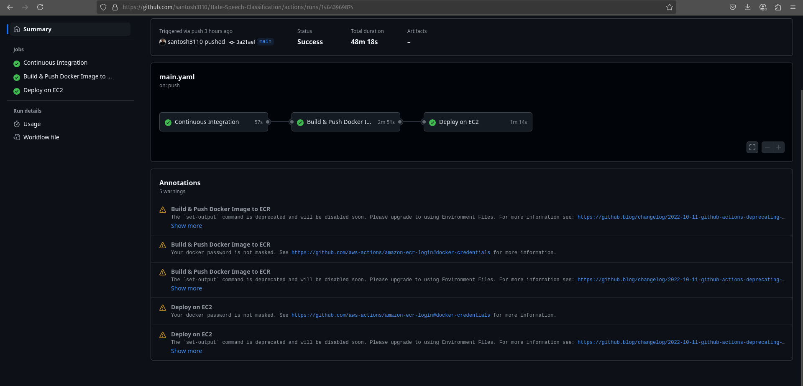
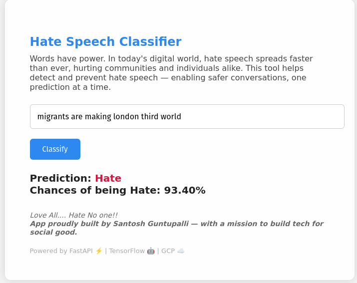
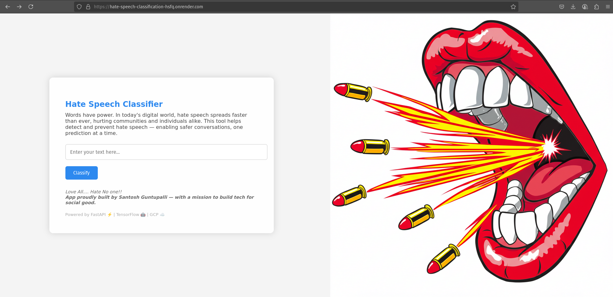
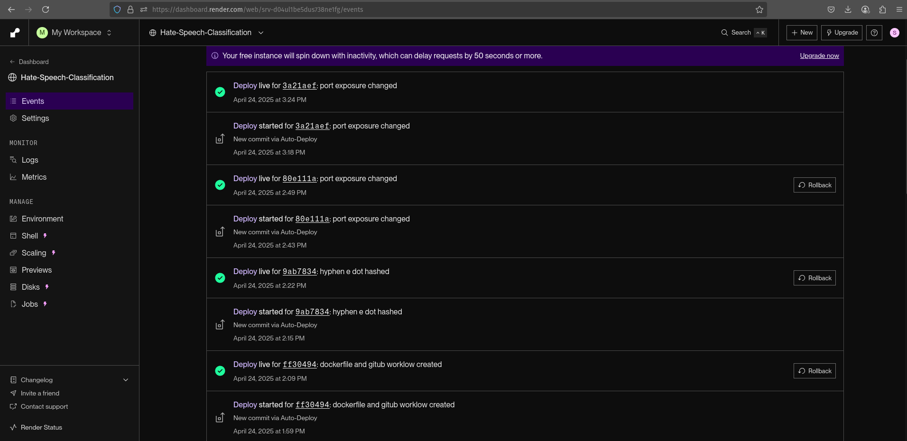
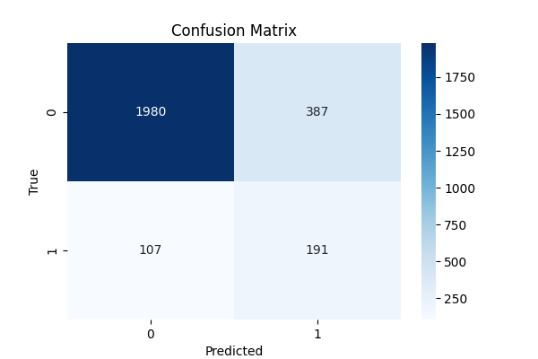

# 🧠 Hate Speech Classifier 🚫

> A full-stack NLP application to identify **hate speech** using state-of-the-art Deep Learning, deployed via **FastAPI** in a Docker container, with a fully automated CI/CD pipeline using GitHub Actions to push to AWS ECR and deploy on EC2, as well as an alternative deployment on Render.  
> **Built with a mission to promote digital harmony and create safer online spaces.**

[](https://hate-speech-classification-hsfq.onrender.com/predict)
[](https://github.com/santosh3110/Hate-Speech-Classification/stargazers)

---

## 📌 Project Overview

The **Hate Speech Classifier** detects hate speech in English text by leveraging the following core components:
- **Data Ingestion & Preprocessing:** Loads the Hugging Face’s `hate_speech18` dataset from GCS, cleans and preprocesses text using NLTK.
- **Embedding Layer:** Utilizes GloVe embeddings to convert text into numerical sequences, with a proper train-test split.
- **Model Architecture:** Implements a hybrid deep learning model that combines Conv1D and Bidirectional LSTM layers along with class weight and regularization techniques.
- **Training & Evaluation:** Trains the model with early stopping and validation,evaluates performance using confusion matrices and classification reports and only pushes best model based on f1-score of minority class(hate).
- **Prediction Pipeline:** Serves predictions using the best model from the gcp cloud via a FastAPI application.
- **Containerization & CI/CD:** Dockerized deployment with automated build-and-push to AWS ECR and deployment to EC2 via GitHub Actions; alternatively, deployed on Render.

---

## 🎯 Objectives

- **Detect Hate Speech:** Identify hate speech in real-time to help moderate and flag harmful content online.
- **Modular Pipeline:** Implement a fully modular ML pipeline with separate stages (data ingestion, preprocessing, embeddings, model building, training, evaluation, and prediction).
- **Scalable Deployment:** Deploy the model using modern CI/CD practices with Docker, AWS (EC2/ECR), and Render for high availability and ease of updates.
- **Promote Social Good:** Use technology to help create safer online environments by reducing the spread of hate speech.

---

## 📁 Dataset

- **Source:** [Hugging Face’s hate_speech18](https://huggingface.co/datasets/odegiber/hate_speech18)
- **Format:** CSV 
- **Size:** Approximately 10K sentences
- **Description:** Text data extracted from online forums (e.g., Stormfront) with manual annotation on hate speech.
- **License:** Open for research purposes

---

## 🏗️ System Architecture

The project consists of the following components:
```
Hate-Speech-Classification/
├── hate_speech_classifier/
│   ├── components/
│   ├── config/
│   ├── constants/
│   ├── entity/
│   ├── exception/
│   ├── logger/
│   └── utils/
├── config/
├── templates/
├── static/
├── Dockerfile
├── .dockerignore
├── requirements.txt
├── setup.py
└── .github/workflows/
```

---

## 🔧 Pipeline Breakdown

1. **Data Ingestion:**  
   - Downloads the dataset (or raw data zip from GCS)  
   - Extracts and stores CSV files in `artifacts/data_ingestion/`

2. **Preprocessing:**  
   - Cleans text data (lowercasing, removing punctuation, stopwords, etc.)  
   - Saves the preprocessed data as `cleaned_data.csv`

3. **Embedding Layer:**  
   - Tokenizes the cleaned text and applies padding  
   - Splits the data into training and testing sets  
   - Loads GloVe embeddings and creates an embedding matrix  
   - Saves the tokenizer and matrix along with train/test splits in `artifacts/split/`

4. **Model Building:**  
   - Constructs a deep learning model using Conv1D, Bidirectional LSTM, Dense, and Dropout layers  
   - Saves the model architecture as JSON in `artifacts/model/`

5. **Model Training:**  
   - Loads training data from the split files  
   - Trains the model using early stopping and validation  
   - Saves the best model (H5) and training history

6. **Model Evaluation:**  
   - Uses test data to evaluate performance  
   - Produces confusion matrix and classification report
   - pushes the saved model to the gcp cloud if the f1_score of the minority hate class is better than the previous trained model

7. **Prediction Pipeline:**  
   - Predicts the text case using the best model saved on the gcp cloud
   - Exposes a FastAPI endpoint for real-time predictions  
   - Provides a web UI (via Jinja2 templates) for interactive use

---

## 🚀 Deployment

### 📦 Dockerized Deployment

1. **Build the Docker image:**
   ```bash
   docker build -t hate-speech-app .

    Run the Docker container locally:

    docker run -d -p 8080:8080 hate-speech-app

    The app will be accessible on: http://localhost:8080

☁️ CI/CD on AWS

Our CI/CD pipeline uses GitHub Actions to:

    Build and push the Docker image to AWS ECR

    Deploy it on an EC2 instance via a self-hosted GitHub runner

GitHub Secrets Required:

      AWS_ACCESS_KEY_ID=****
      AWS_SECRET_ACCESS_KEY=****
      AWS_REGION=eu-west-2
      AWS_ECR_LOGIN_URI=741448950156.dkr.ecr.eu-west-2.amazonaws.com
      ECR_REPOSITORY_NAME=hate_speech_classifier






Deployment Steps:

    Integration: Code linting and unit tests run on push.

    Build-and-Push: The Docker image is built and tagged, then pushed to AWS ECR.

    Continuous Deployment: A self-hosted runner on EC2 pulls the image and runs the container.

    Security: All sensitive keys are managed via GitHub Secrets and IAM roles.

✅ Render Deployment

Alternatively, the app is deployed on Render and is live at:
https://hate-speech-classification-hsfq.onrender.com/

---

📸 Screenshots:

Web UI on Render:



CI/CD Pipeline Success:



---

🧠 Model Performance (Metrics)

| Metric           | Value   |
|------------------|---------|
| Accuracy         | 80.97%  |
| F1-Score (Hate)  | 0.44    |

📉 Confusion Matrix




📚 How to Run Locally

    Clone the repository:

      git clone https://github.com/santosh3110/Hate-Speech-Classification.git
      cd Hate-Speech-Classification

Set up the environment:

      python -m venv venv
      source venv/bin/activate  # On Windows: venv\Scripts\activate
      pip install -r requirements.txt

Run the FastAPI app:

    uvicorn predict:app --reload

    Access at: http://localhost:8000

📦 How to Build with Docker

    Build the image:

      docker build -t hate-speech-app .

Run the container:

    docker run -d -p 8080:8080 hate-speech-app

    Access at: http://localhost:8080

🧭 CI/CD Pipeline (AWS Deployment)

Follow these steps:

    Set up GitHub Actions as defined in .github/workflows/main.yaml.

    Configure GitHub Secrets (AWS credentials, ECR info).

    Deploy on EC2: The runner will pull and run the Docker image on EC2.

    Access on EC2: Visit http://<EC2_PUBLIC_IP>:8080.

📜 License

This project is licensed under the Apache 2.0 License – free for use and contribution.

🙌 Contributions

Contributions, improvements, and ideas are welcome! Feel free to fork the project, open issues, and submit pull requests.

---

📬 Contact

👤 Santosh Guntupalli**  
📧 Email: [santoshkumarguntupalli@gmail.com](mailto:santoshkumarguntupalli@gmail.com)  
🐙 GitHub: [@santosh3110](https://github.com/santosh3110)  

> 💬 _"Love all, hate none — and let AI help us build a kinder internet."_

⭐ Show Some Love

If you found this project helpful:

   Star this repo on GitHub

   Fork and share your improvements

   Spread the word to help create a safer digital space!

